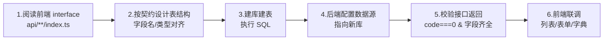

# 数据库设计与接入指南（DATABASE_DESIGN.md）

> 本文档面向「**我要接入自己的数据库**」的场景，给出从**前端类型契约 → 后端表结构 → 数据库物理设计**的完整映射方法，并附**建表 SQL 片段**及其**对应的前端字段应用片段引用**。

---

## 目录

- [一、架构前提：数据从哪来](#一架构前提数据从哪来)
- [二、接入自有数据库的整体步骤](#二接入自有数据库的整体步骤)
- [三、通用设计约定（务必先读）](#三通用设计约定务必先读)
- [四、核心表结构设计（SQL + 前端字段应用引用）](#四核心表结构设计sql--前端字段应用引用)
  - [4.1 系统用户 system_users](#41-系统用户-system_users)
  - [4.2 菜单权限 system_menu](#42-菜单权限-system_menu)
  - [4.3 角色 system_role](#43-角色-system_role)
  - [4.4 字典 system_dict_type / system_dict_data](#44-字典-system_dict_type--system_dict_data)
  - [4.5 支付订单 pay_order](#45-支付订单-pay_order)
  - [4.6 会员用户 member_user](#46-会员用户-member_user)
  - [4.7 商城商品 product_spu / product_sku](#47-商城商品-product_spu--product_sku)
  - [4.8 商城订单 trade_order](#48-商城订单-trade_order)
- [五、数据源与连接配置](#五数据源与连接配置)
- [六、字段映射对照表（TS 类型 → SQL 类型）](#六字段映射对照表ts-类型--sql-类型)
- [七、接入自查清单](#七接入自查清单)

---

## 一、架构前提：数据从哪来

本仓库是**前端中台框架**，本身**不直接连数据库**。数据链路为：

```
Vue 页面 → api/**/index.ts(TS interface) → RequestClient(axios)
        → /admin-api → 后端(Java) → 你的数据库(MySQL/…)
```

因此「接入自己的数据库」有两种含义，本文档均覆盖：

1. **后端换库/建库**（主路径）：后端服务连接你的数据库，你需要按前端 `interface` 契约设计**兼容的表结构**，保证接口返回字段与前端一致。
2. **前端对接新接口**：若后端字段命名不同，需在前端 `api` 层调整 `interface` 与请求路径。

> 关键原则：**前端 `namespace XxxApi { interface Entity }` 就是数据库表结构的「契约镜像」**。设计表时逐字段对齐它，即可无缝接入。

---

## 二、接入自有数据库的整体步骤



---

## 三、通用设计约定（务必先读）

从前端各 `interface` 中提炼的**跨表通用规律**，建表时统一遵守：

| 约定 | 说明 | 依据（前端契约） |
| --- | --- | --- |
| **主键 `id`** | `bigint unsigned` 自增，前端为 `id?: number` | 几乎所有 interface 首字段 |
| **状态 `status`** | `tinyint`，`0=启用 / 1=禁用`（COMMON_STATUS 字典） | `User.status` / `Role.status` 等 |
| **排序 `sort`** | `int`，越小越靠前 | `Role.sort` / `Menu.sort` / `Dept.sort` |
| **金额单位=分** | 所有价格/金额存 `int`/`bigint`（分），前端用 `formatFenToYuanAmount`/`formatAmount2` 显示 | `Spu.price` / `Order.payPrice` / `Wallet.balance` |
| **树形 `parentId`** | 自引用外键，`0` 表示顶级 | `Menu.parentId` / `Dept.parentId` / `Category.parentId` |
| **审计字段** | `create_time`/`update_time`/`creator`/`updater`/`deleted`(逻辑删) | `createTime?: Date` 广泛存在 |
| **多租户 `tenant_id`** | 开启多租户时每表加 `tenant_id bigint` | 请求头 `tenant-id`（`SystemTenantApi.Tenant`） |
| **数组字段** | 后端多为**关联表**或 JSON 字符串（如 `postIds:string[]`、`tagIds:number[]`） | `User.postIds` / `MemberUser.tagIds` |
| **`xxxName` 展示字段** | 后端 join 出来的**只读字段**，**不建列**（如 `deptName`/`groupName`） | `User.deptName?` / `MemberUser.groupName` |

---

## 四、核心表结构设计（SQL + 前端字段应用引用）

以下每个表：先给**前端契约**（TS interface，来源文件路径），再给**建表 SQL 片段**，最后给**该字段在页面中的应用片段引用**（表格列/表单 schema）。

### 4.1 系统用户 system_users

**前端契约**（[apps/web-antd/src/api/system/user/index.ts](file:///Users/tog/Desktop/code/gsb/gsb-723/xyj-723-4/xyj-723-4_Bulbasaur/apps/web-antd/src/api/system/user/index.ts#L5-L29)）：

```typescript
export namespace SystemUserApi {
  export interface User {
    id?: number;
    username: string;
    nickname: string;
    deptId: number;
    deptName?: string;   // 后端 join，只读，不建列
    postIds: string[];   // 关联表 system_user_post
    email: string;
    mobile: string;
    sex: number;
    avatar: string;
    loginIp: string;
    loginDate?: Date;
    status: number;
    remark: string;
    createTime?: Date;
  }
}
```

**建表 SQL 片段**：

```sql
CREATE TABLE `system_users` (
  `id`          BIGINT       NOT NULL AUTO_INCREMENT COMMENT '用户ID',
  `username`    VARCHAR(30)  NOT NULL                COMMENT '用户账号',
  `nickname`    VARCHAR(30)  NOT NULL                COMMENT '用户昵称',
  `dept_id`     BIGINT       DEFAULT NULL            COMMENT '部门ID (→ system_dept.id)',
  `email`       VARCHAR(50)  DEFAULT ''              COMMENT '用户邮箱',
  `mobile`      VARCHAR(11)  DEFAULT ''              COMMENT '手机号码',
  `sex`         TINYINT      DEFAULT '0'             COMMENT '性别 (字典 system_user_sex)',
  `avatar`      VARCHAR(512) DEFAULT ''              COMMENT '头像地址',
  `login_ip`    VARCHAR(50)  DEFAULT ''              COMMENT '最后登录IP',
  `login_date`  DATETIME     DEFAULT NULL            COMMENT '最后登录时间',
  `status`      TINYINT      NOT NULL DEFAULT '0'    COMMENT '状态 0启用 1禁用',
  `remark`      VARCHAR(500) DEFAULT NULL            COMMENT '备注',
  `tenant_id`   BIGINT       NOT NULL DEFAULT '0'    COMMENT '租户编号',
  `creator`     VARCHAR(64)  DEFAULT ''              COMMENT '创建者',
  `create_time` DATETIME     NOT NULL DEFAULT CURRENT_TIMESTAMP COMMENT '创建时间',
  `updater`     VARCHAR(64)  DEFAULT ''              COMMENT '更新者',
  `update_time` DATETIME     NOT NULL DEFAULT CURRENT_TIMESTAMP ON UPDATE CURRENT_TIMESTAMP,
  `deleted`     BIT(1)       NOT NULL DEFAULT b'0'   COMMENT '逻辑删除',
  PRIMARY KEY (`id`),
  KEY `idx_username` (`username`, `update_time`)
) ENGINE=InnoDB DEFAULT CHARSET=utf8mb4 COMMENT='用户信息表';

-- postIds:string[] 用关联表实现多对多（用户-岗位）
CREATE TABLE `system_user_post` (
  `id`      BIGINT NOT NULL AUTO_INCREMENT,
  `user_id` BIGINT NOT NULL COMMENT '用户ID',
  `post_id` BIGINT NOT NULL COMMENT '岗位ID (→ system_post.id)',
  PRIMARY KEY (`id`)
) ENGINE=InnoDB DEFAULT CHARSET=utf8mb4 COMMENT='用户岗位关联表';
```

**前端字段应用片段引用**：`username / nickname / deptName / status` 在用户列表表格列中的使用，见 [apps/web-antd/src/views/system/user/data.ts](file:///Users/tog/Desktop/code/gsb/gsb-723/xyj-723-4/xyj-723-4_Bulbasaur/apps/web-antd/src/views/system/user/data.ts#L306-L339)：

```typescript
{ field: 'username', title: '用户名称', minWidth: 120 },
{ field: 'nickname', title: '用户昵称', minWidth: 120 },
{ field: 'deptName', title: '部门',     minWidth: 120 },  // 只读展示字段
{
  field: 'status', title: '状态', align: 'center',
  cellRender: {
    name: 'CellSwitch',
    props: { checkedValue: CommonStatusEnum.ENABLE, unCheckedValue: CommonStatusEnum.DISABLE },
  },
}
```

> `status` 用 `CellSwitch` 开关列渲染，`checkedValue/unCheckedValue` 对应库中 `status` 的 `0/1` —— 这正是「状态 tinyint」设计的来源。

---

### 4.2 菜单权限 system_menu

**前端契约**（[apps/web-antd/src/api/system/menu/index.ts](file:///Users/tog/Desktop/code/gsb/gsb-723/xyj-723-4/xyj-723-4_Bulbasaur/apps/web-antd/src/api/system/menu/index.ts#L3-L22)）：

```typescript
export namespace SystemMenuApi {
  export interface Menu {
    id: number;
    name: string;
    permission: string;   // 权限标识，前端 v-access 校验
    type: number;         // 1目录 2菜单 3按钮
    sort: number;
    parentId: number;     // 0=顶级
    path: string;
    icon: string;
    component: string;
    componentName?: string;
    status: number;
    visible: boolean;
    keepAlive: boolean;
    alwaysShow?: boolean;
    createTime: Date;
  }
}
```

**建表 SQL 片段**：

```sql
CREATE TABLE `system_menu` (
  `id`             BIGINT       NOT NULL AUTO_INCREMENT COMMENT '菜单ID',
  `name`           VARCHAR(50)  NOT NULL                COMMENT '菜单名称',
  `permission`     VARCHAR(100) NOT NULL DEFAULT ''     COMMENT '权限标识 如 system:user:list',
  `type`           TINYINT      NOT NULL                COMMENT '类型 1目录 2菜单 3按钮',
  `sort`           INT          NOT NULL DEFAULT '0'    COMMENT '显示顺序',
  `parent_id`      BIGINT       NOT NULL DEFAULT '0'    COMMENT '父菜单ID 0=顶级',
  `path`           VARCHAR(200) DEFAULT ''              COMMENT '路由地址',
  `icon`           VARCHAR(100) DEFAULT '#'             COMMENT '菜单图标',
  `component`      VARCHAR(255) DEFAULT NULL            COMMENT '组件路径',
  `component_name` VARCHAR(255) DEFAULT NULL            COMMENT '组件名(keep-alive用)',
  `status`         TINYINT      NOT NULL DEFAULT '0'    COMMENT '状态 0启用 1禁用',
  `visible`        BIT(1)       NOT NULL DEFAULT b'1'   COMMENT '是否可见',
  `keep_alive`     BIT(1)       NOT NULL DEFAULT b'1'   COMMENT '是否缓存',
  `always_show`    BIT(1)       NOT NULL DEFAULT b'1'   COMMENT '是否总是显示',
  `create_time`    DATETIME     NOT NULL DEFAULT CURRENT_TIMESTAMP,
  PRIMARY KEY (`id`)
) ENGINE=InnoDB DEFAULT CHARSET=utf8mb4 COMMENT='菜单权限表';
```

**前端字段应用片段引用**：`name / type / permission` 在菜单列表中的使用，见 [apps/web-antd/src/views/system/menu/data.ts](file:///Users/tog/Desktop/code/gsb/gsb-723/xyj-723-4/xyj-723-4_Bulbasaur/apps/web-antd/src/views/system/menu/data.ts#L293-L332)：

```typescript
{ field: 'name', title: '菜单名称', treeNode: true, fixed: 'left' },  // 树形节点
{
  field: 'type', title: '菜单类型',
  cellRender: { name: 'CellDict', props: { type: DICT_TYPE.SYSTEM_MENU_TYPE } },
},
{ field: 'permission', title: '权限标识', minWidth: 200 }
```

> `name` 列 `treeNode: true` 对应 `parent_id` 自引用树；`type` 用 `CellDict` 按字典 `SYSTEM_MENU_TYPE` 渲染，对应 SQL 中 `type tinyint`（1/2/3）。

---

### 4.3 角色 system_role

**前端契约**（[apps/web-antd/src/api/system/role/index.ts](file:///Users/tog/Desktop/code/gsb/gsb-723/xyj-723-4/xyj-723-4_Bulbasaur/apps/web-antd/src/api/system/role/index.ts#L5-L18)）：

```typescript
export interface Role {
  id?: number;
  name: string;
  code: string;
  sort: number;
  status: number;
  type: number;
  dataScope: number;          // 数据范围类型
  dataScopeDeptIds: number[]; // 自定义数据范围-部门集合
  createTime?: Date;
}
```

**建表 SQL 片段**：

```sql
CREATE TABLE `system_role` (
  `id`                  BIGINT       NOT NULL AUTO_INCREMENT COMMENT '角色ID',
  `name`                VARCHAR(30)  NOT NULL                COMMENT '角色名称',
  `code`                VARCHAR(100) NOT NULL                COMMENT '角色权限字符串',
  `sort`                INT          NOT NULL                COMMENT '显示顺序',
  `data_scope`          TINYINT      NOT NULL DEFAULT '1'    COMMENT '数据范围 1全部 2自定义 3本部门…',
  `data_scope_dept_ids` VARCHAR(500) NOT NULL DEFAULT ''     COMMENT '数据范围(部门ID,逗号分隔)',
  `status`              TINYINT      NOT NULL                COMMENT '状态 0启用 1禁用',
  `type`                TINYINT      NOT NULL                COMMENT '角色类型',
  `create_time`         DATETIME     NOT NULL DEFAULT CURRENT_TIMESTAMP,
  PRIMARY KEY (`id`)
) ENGINE=InnoDB DEFAULT CHARSET=utf8mb4 COMMENT='角色表';

-- 角色-菜单授权（RBAC 核心关联）
CREATE TABLE `system_role_menu` (
  `id`      BIGINT NOT NULL AUTO_INCREMENT,
  `role_id` BIGINT NOT NULL COMMENT '角色ID',
  `menu_id` BIGINT NOT NULL COMMENT '菜单ID',
  PRIMARY KEY (`id`)
) ENGINE=InnoDB DEFAULT CHARSET=utf8mb4 COMMENT='角色和菜单关联表';
```

> `dataScopeDeptIds: number[]` 在库中以逗号分隔字符串存储，是 yudao 数据权限的典型做法。

---

### 4.4 字典 system_dict_type / system_dict_data

**前端契约**（[dict/type](file:///Users/tog/Desktop/code/gsb/gsb-723/xyj-723-4/xyj-723-4_Bulbasaur/apps/web-antd/src/api/system/dict/type/index.ts#L5-L15) 与 [dict/data](file:///Users/tog/Desktop/code/gsb/gsb-723/xyj-723-4/xyj-723-4_Bulbasaur/apps/web-antd/src/api/system/dict/data/index.ts#L5-L19)）：

```typescript
export type DictType = { id?: number; name: string; type: string; status: number; remark: string; createTime: Date; };
export type DictData = {
  id?: number; label: string; value: string; dictType: string; // FK → DictType.type
  sort?: number; status: number; colorType: string; cssClass: string; remark: string; createTime: Date;
};
```

**建表 SQL 片段**：

```sql
CREATE TABLE `system_dict_type` (
  `id`     BIGINT      NOT NULL AUTO_INCREMENT,
  `name`   VARCHAR(100) NOT NULL DEFAULT '' COMMENT '字典名称',
  `type`   VARCHAR(100) NOT NULL DEFAULT '' COMMENT '字典类型(唯一)',
  `status` TINYINT      NOT NULL DEFAULT '0' COMMENT '状态',
  `remark` VARCHAR(500) DEFAULT NULL,
  `create_time` DATETIME NOT NULL DEFAULT CURRENT_TIMESTAMP,
  PRIMARY KEY (`id`),
  UNIQUE KEY `uk_type` (`type`)
) ENGINE=InnoDB DEFAULT CHARSET=utf8mb4 COMMENT='字典类型表';

CREATE TABLE `system_dict_data` (
  `id`         BIGINT       NOT NULL AUTO_INCREMENT,
  `sort`       INT          NOT NULL DEFAULT '0'  COMMENT '排序',
  `label`      VARCHAR(100) NOT NULL DEFAULT ''   COMMENT '字典标签(显示)',
  `value`      VARCHAR(100) NOT NULL DEFAULT ''   COMMENT '字典键值',
  `dict_type`  VARCHAR(100) NOT NULL DEFAULT ''   COMMENT '字典类型(→ system_dict_type.type)',
  `status`     TINYINT      NOT NULL DEFAULT '0'  COMMENT '状态',
  `color_type` VARCHAR(100) DEFAULT ''            COMMENT '颜色类型',
  `css_class`  VARCHAR(100) DEFAULT ''            COMMENT 'CSS样式',
  `remark`     VARCHAR(500) DEFAULT NULL,
  `create_time` DATETIME NOT NULL DEFAULT CURRENT_TIMESTAMP,
  PRIMARY KEY (`id`),
  KEY `idx_dict_type` (`dict_type`)
) ENGINE=InnoDB DEFAULT CHARSET=utf8mb4 COMMENT='字典数据表';
```

> **前端应用**：字典数据被 `useDictStore`（[packages/stores/src/modules/dict.ts](file:///Users/tog/Desktop/code/gsb/gsb-723/xyj-723-4/xyj-723-4_Bulbasaur/packages/stores/src/modules/dict.ts)）全局缓存，`label/value/colorType/cssClass` 供 `CellDict` 渲染彩色标签（如上文菜单 `type` 列）。`dict_type` 是回指 `system_dict_type.type` 的外键。

---

### 4.5 支付订单 pay_order

**前端契约**（[apps/web-antd/src/api/pay/order/index.ts](file:///Users/tog/Desktop/code/gsb/gsb-723/xyj-723-4/xyj-723-4_Bulbasaur/apps/web-antd/src/api/pay/order/index.ts#L7-L40)，节选核心字段）：

```typescript
export interface Order {
  id: number;
  no: string;               // 订单号(唯一)
  appId: number;            // → pay_app.id
  channelId: number;        // → pay_channel.id
  channelCode: string;      // 渠道编码 wx_pub/alipay_pc…
  merchantOrderId: string;  // 商户订单号
  subject: string; body: string;
  price: number;            // 支付金额(分)
  channelFeePrice: number;  // 手续费(分)
  refundPrice: number;      // 退款金额(分)
  status: number;           // 0未支付 10已支付 20关闭
  refundStatus: number; refundTimes: number;
  userIp: string;
  expireTime: Date; successTime: Date; notifyTime: Date;
  channelOrderNo: string; channelUserId: string;
  createTime: Date; updateTime: Date;
}
```

**建表 SQL 片段**：

```sql
CREATE TABLE `pay_order` (
  `id`                BIGINT       NOT NULL AUTO_INCREMENT COMMENT '支付订单编号',
  `no`                VARCHAR(64)  NOT NULL                COMMENT '支付订单号',
  `app_id`            BIGINT       NOT NULL                COMMENT '应用编号 (→ pay_app.id)',
  `channel_id`        BIGINT       DEFAULT NULL            COMMENT '渠道编号 (→ pay_channel.id)',
  `channel_code`      VARCHAR(32)  DEFAULT NULL            COMMENT '渠道编码',
  `merchant_order_id` VARCHAR(64)  NOT NULL                COMMENT '商户订单号',
  `subject`           VARCHAR(32)  NOT NULL                COMMENT '商品标题',
  `body`              VARCHAR(128) NOT NULL                COMMENT '商品描述',
  `price`             INT          NOT NULL                COMMENT '支付金额(分)',
  `channel_fee_price` INT          NOT NULL DEFAULT '0'    COMMENT '渠道手续费(分)',
  `refund_price`      INT          NOT NULL DEFAULT '0'    COMMENT '退款金额(分)',
  `status`            TINYINT      NOT NULL DEFAULT '0'    COMMENT '0未支付 10已支付 20关闭',
  `refund_status`     TINYINT      NOT NULL DEFAULT '0'    COMMENT '退款状态',
  `user_ip`           VARCHAR(50)  DEFAULT NULL            COMMENT '用户IP',
  `expire_time`       DATETIME     DEFAULT NULL            COMMENT '订单失效时间',
  `success_time`      DATETIME     DEFAULT NULL            COMMENT '订单支付成功时间',
  `notify_time`       DATETIME     DEFAULT NULL            COMMENT '通知回调时间',
  `channel_order_no`  VARCHAR(64)  DEFAULT NULL            COMMENT '渠道订单号',
  `tenant_id`         BIGINT       NOT NULL DEFAULT '0',
  `create_time`       DATETIME     NOT NULL DEFAULT CURRENT_TIMESTAMP,
  `update_time`       DATETIME     NOT NULL DEFAULT CURRENT_TIMESTAMP ON UPDATE CURRENT_TIMESTAMP,
  PRIMARY KEY (`id`),
  UNIQUE KEY `uk_no` (`no`),
  KEY `idx_app_merchant` (`app_id`, `merchant_order_id`)
) ENGINE=InnoDB DEFAULT CHARSET=utf8mb4 COMMENT='支付订单表';
```

**前端字段应用片段引用**：`price / refundPrice / channelFeePrice / no / status / channelCode`，见 [apps/web-antd/src/views/pay/order/data.ts](file:///Users/tog/Desktop/code/gsb/gsb-723/xyj-723-4/xyj-723-4_Bulbasaur/apps/web-antd/src/views/pay/order/data.ts#L95-L138)：

```typescript
{ field: 'price',           title: '支付金额', formatter: 'formatAmount2' }, // 分→元
{ field: 'refundPrice',     title: '退款金额', formatter: 'formatAmount2' },
{ field: 'channelFeePrice', title: '手续金额', formatter: 'formatAmount2' },
{ field: 'no',              title: '订单号',   slots: { default: 'no' } },
{
  field: 'status', title: '支付状态',
  cellRender: { name: 'CellDict', props: { type: DICT_TYPE.PAY_ORDER_STATUS } },
}
```

> `formatAmount2` 印证了 `price` 等金额列在库中以**分**存储；`status` 的字典 `PAY_ORDER_STATUS` 对应 [biz-pay-enum.ts](file:///Users/tog/Desktop/code/gsb/gsb-723/xyj-723-4/xyj-723-4_Bulbasaur/packages/constants/src/biz-pay-enum.ts#L89-L105) 的 `0/10/20`，即 SQL 中 `status tinyint` 的取值来源。

---

### 4.6 会员用户 member_user

**前端契约**（[apps/web-antd/src/api/member/user/index.ts](file:///Users/tog/Desktop/code/gsb/gsb-723/xyj-723-4/xyj-723-4_Bulbasaur/apps/web-antd/src/api/member/user/index.ts#L7-L44)，节选）：

```typescript
export interface User {
  id?: number;
  avatar?: string; nickname?: string; name?: string;
  mobile?: string; email?: string; sex?: number;
  birthday?: number; mark?: string;
  status?: number;
  areaId?: number;    areaName?: string;   // areaName 只读
  tagIds?: number[];  groupId?: number;    // 关联标签/分组
  levelId?: number;   levelName?: null | string;  // levelName 只读
  point?: null | number; totalPoint?: null | number; experience?: null | number;
  loginIp?: string; loginDate?: number; registerIp?: string; createTime?: number;
}
```

**建表 SQL 片段**：

```sql
CREATE TABLE `member_user` (
  `id`           BIGINT       NOT NULL AUTO_INCREMENT COMMENT '会员编号',
  `mobile`       VARCHAR(11)  NOT NULL                COMMENT '手机号(登录账号)',
  `email`        VARCHAR(50)  DEFAULT ''              COMMENT '邮箱',
  `nickname`     VARCHAR(30)  NOT NULL DEFAULT ''     COMMENT '用户昵称',
  `name`         VARCHAR(30)  DEFAULT NULL            COMMENT '真实姓名',
  `avatar`       VARCHAR(256) DEFAULT ''              COMMENT '头像',
  `sex`          TINYINT      DEFAULT '0'             COMMENT '性别',
  `birthday`     DATETIME     DEFAULT NULL            COMMENT '出生日期',
  `mark`         VARCHAR(255) DEFAULT NULL            COMMENT '会员备注',
  `area_id`      BIGINT       DEFAULT NULL            COMMENT '所在地(→ system_area.id)',
  `group_id`     BIGINT       DEFAULT NULL            COMMENT '会员分组(→ member_group.id)',
  `level_id`     BIGINT       DEFAULT NULL            COMMENT '会员等级(→ member_level.id)',
  `experience`   INT          NOT NULL DEFAULT '0'    COMMENT '当前经验',
  `point`        INT          NOT NULL DEFAULT '0'    COMMENT '当前积分',
  `status`       TINYINT      NOT NULL DEFAULT '0'    COMMENT '状态 0启用 1禁用',
  `register_ip`  VARCHAR(50)  NOT NULL DEFAULT ''     COMMENT '注册IP',
  `login_ip`     VARCHAR(50)  DEFAULT ''              COMMENT '最后登录IP',
  `login_date`   DATETIME     DEFAULT NULL            COMMENT '最后登录时间',
  `tenant_id`    BIGINT       NOT NULL DEFAULT '0',
  `create_time`  DATETIME     NOT NULL DEFAULT CURRENT_TIMESTAMP,
  PRIMARY KEY (`id`),
  UNIQUE KEY `uk_mobile` (`mobile`, `tenant_id`)
) ENGINE=InnoDB DEFAULT CHARSET=utf8mb4 COMMENT='会员用户表';

-- tagIds:number[] 多对多 → 会员-标签关联表
CREATE TABLE `member_user_tag` (
  `user_id` BIGINT NOT NULL, `tag_id` BIGINT NOT NULL,
  PRIMARY KEY (`user_id`, `tag_id`)
) ENGINE=InnoDB DEFAULT CHARSET=utf8mb4 COMMENT='会员标签关联表';
```

**前端字段应用片段引用**：`mobile / email / nickname / name / sex` 在会员编辑表单中的使用，见 [apps/web-antd/src/views/member/user/data.ts](file:///Users/tog/Desktop/code/gsb/gsb-723/xyj-723-4/xyj-723-4_Bulbasaur/apps/web-antd/src/views/member/user/data.ts#L30-L91)：

```typescript
{ fieldName: 'mobile',   label: '手机号',   component: 'Input', rules: 'required' },
{ fieldName: 'email',    label: '邮箱',     component: 'Input',
  rules: z.string().email('邮箱格式不正确').or(z.literal('')).optional() },  // zod 校验
{ fieldName: 'nickname', label: '用户昵称', component: 'Input' },
{ fieldName: 'name',     label: '真实名字', component: 'Input' },
{ fieldName: 'sex',      label: '用户性别', component: 'RadioGroup' }
```

> `mobile` 为 `required` → SQL 中 `mobile NOT NULL` 且做唯一键；`email` 的 zod 校验对应库中 `email VARCHAR(50)`；`sex` 用 `RadioGroup`（字典）对应 `sex tinyint`。注意 `groupName`/`tagNames`/`levelName` 为后端 join 只读字段，**不建列**。

---

### 4.7 商城商品 product_spu / product_sku

**前端契约**（[apps/web-antd/src/api/mall/product/spu/index.ts](file:///Users/tog/Desktop/code/gsb/gsb-723/xyj-723-4/xyj-723-4_Bulbasaur/apps/web-antd/src/api/mall/product/spu/index.ts#L7-L63)，节选）：

```typescript
export interface Spu {
  id?: number; name?: string; categoryId?: number; brandId?: number;
  keyword?: string; picUrl?: string; sliderPicUrls?: string[]; introduction?: string;
  specType?: boolean;   // 是否多规格
  skus?: Sku[];         // 一对多 → product_sku
  price?: number; marketPrice?: number; costPrice?: number; // 分
  stock?: number; salesCount?: number; virtualSalesCount?: number; browseCount?: number;
  sort?: number; status?: number; createTime?: Date;
}
export interface Sku {
  id?: number; spuId?: number; name?: string;
  price?: number | string; marketPrice?: number | string; costPrice?: number | string;
  stock?: number; barCode?: string; picUrl?: string; weight?: number; volume?: number;
  firstBrokeragePrice?: number | string; secondBrokeragePrice?: number | string;
  properties?: Property[]; // 规格属性
}
```

**建表 SQL 片段**（SPU 主表 + SKU 子表一对多）：

```sql
CREATE TABLE `product_spu` (
  `id`                  BIGINT       NOT NULL AUTO_INCREMENT COMMENT '商品SPU编号',
  `name`                VARCHAR(128) NOT NULL DEFAULT ''     COMMENT '商品名称',
  `category_id`         BIGINT       NOT NULL                COMMENT '分类(→ product_category.id)',
  `brand_id`            BIGINT       DEFAULT NULL            COMMENT '品牌(→ product_brand.id)',
  `keyword`             VARCHAR(256) DEFAULT ''              COMMENT '关键字',
  `pic_url`             VARCHAR(256) NOT NULL                COMMENT '封面图',
  `slider_pic_urls`     VARCHAR(2000) DEFAULT ''             COMMENT '轮播图(JSON数组)',
  `introduction`        VARCHAR(256) DEFAULT ''              COMMENT '简介',
  `spec_type`           BIT(1)       NOT NULL DEFAULT b'0'   COMMENT '是否多规格',
  `price`               INT          NOT NULL DEFAULT '-1'   COMMENT '最小价格(分)',
  `market_price`        INT          DEFAULT NULL            COMMENT '市场价(分)',
  `cost_price`          INT          DEFAULT NULL            COMMENT '成本价(分)',
  `stock`               INT          NOT NULL DEFAULT '0'    COMMENT '库存',
  `sales_count`         INT          NOT NULL DEFAULT '0'    COMMENT '销量',
  `virtual_sales_count` INT          NOT NULL DEFAULT '0'    COMMENT '虚拟销量',
  `browse_count`        INT          NOT NULL DEFAULT '0'    COMMENT '浏览量',
  `sort`                INT          NOT NULL DEFAULT '0',
  `status`              TINYINT      NOT NULL DEFAULT '0'    COMMENT '0下架 1上架',
  `tenant_id`           BIGINT       NOT NULL DEFAULT '0',
  `create_time`         DATETIME     NOT NULL DEFAULT CURRENT_TIMESTAMP,
  PRIMARY KEY (`id`),
  KEY `idx_category` (`category_id`)
) ENGINE=InnoDB DEFAULT CHARSET=utf8mb4 COMMENT='商品SPU表';

CREATE TABLE `product_sku` (
  `id`             BIGINT       NOT NULL AUTO_INCREMENT COMMENT 'SKU编号',
  `spu_id`         BIGINT       NOT NULL                COMMENT 'SPU编号(→ product_spu.id)',
  `properties`     VARCHAR(512) DEFAULT ''              COMMENT '规格属性(JSON)',
  `price`          INT          NOT NULL DEFAULT '-1'   COMMENT '销售价(分)',
  `market_price`   INT          DEFAULT NULL            COMMENT '市场价(分)',
  `cost_price`     INT          DEFAULT NULL            COMMENT '成本价(分)',
  `bar_code`       VARCHAR(64)  DEFAULT ''              COMMENT '条码',
  `pic_url`        VARCHAR(256) DEFAULT '',
  `stock`          INT          NOT NULL DEFAULT '0'    COMMENT '库存',
  `weight`         DOUBLE       DEFAULT NULL            COMMENT '重量(kg)',
  `volume`         DOUBLE       DEFAULT NULL            COMMENT '体积(m³)',
  PRIMARY KEY (`id`),
  KEY `idx_spu` (`spu_id`)
) ENGINE=InnoDB DEFAULT CHARSET=utf8mb4 COMMENT='商品SKU表';
```

**前端字段应用片段引用**：`categoryId / status / price / marketPrice / costPrice`，见 [apps/web-antd/src/views/mall/product/spu/data.ts](file:///Users/tog/Desktop/code/gsb/gsb-723/xyj-723-4/xyj-723-4_Bulbasaur/apps/web-antd/src/views/mall/product/spu/data.ts#L79-L117)：

```typescript
{ field: 'categoryId', title: '商品分类',
  formatter: ({ row }) => treeToString(categoryList, row.categoryId) }, // 分类树回显
{ field: 'status', title: '销售状态',
  cellRender: { name: 'CellSwitch',
    props: { checkedValue: 1, checkedChildren: '上架', unCheckedValue: 0, unCheckedChildren: '下架' } } },
{ field: 'price',       title: '价格(元)',   formatter: 'formatFenToYuanAmount' },
{ field: 'marketPrice', title: '市场价(元)', formatter: 'formatFenToYuanAmount' },
{ field: 'costPrice',   title: '成本价(元)', formatter: 'formatFenToYuanAmount' }
```

> `formatFenToYuanAmount`（分→元）直接证明 `price/market_price/cost_price` 在库中为 `int`（分）；`categoryId` 用 `treeToString` 回显树，对应 `product_category.parent_id` 树结构；`status` 开关值 `1上架/0下架` 对应 `status tinyint`。

---

### 4.8 商城订单 trade_order

**前端契约**（[apps/web-antd/src/api/mall/trade/order/index.ts](file:///Users/tog/Desktop/code/gsb/gsb-723/xyj-723-4/xyj-723-4_Bulbasaur/apps/web-antd/src/api/mall/trade/order/index.ts#L7-L99)，节选）：

```typescript
export interface Order {
  id?: number; no?: string; type?: number; terminal?: number;
  userId?: number; status?: number;
  payOrderId?: number;   // → pay_order.id （交易订单关联支付订单）
  payStatus?: boolean; payTime?: Date; payChannelCode?: string;
  totalPrice?: number; discountPrice?: number; deliveryPrice?: number; payPrice?: number; // 分
  couponId?: number; couponPrice?: number; pointPrice?: number;
  receiverName?: string; receiverMobile?: string; receiverDetailAddress?: string;
  logisticsId?: number; logisticsNo?: string; deliveryTime?: Date; receiveTime?: Date;
  afterSaleStatus?: number; refundPrice?: number;
  items?: OrderItem[];   // 一对多 → trade_order_item
}
export interface OrderItem {
  id?: number; orderId?: number; spuId?: number; spuName?: string; skuId?: number;
  picUrl?: string; count?: number; payPrice?: number;
}
```

**建表 SQL 片段**：

```sql
CREATE TABLE `trade_order` (
  `id`                     BIGINT       NOT NULL AUTO_INCREMENT COMMENT '订单编号',
  `no`                     VARCHAR(32)  NOT NULL                COMMENT '订单流水号',
  `type`                   TINYINT      NOT NULL DEFAULT '0'    COMMENT '订单类型',
  `terminal`               TINYINT      NOT NULL DEFAULT '0'    COMMENT '订单来源',
  `user_id`                BIGINT       NOT NULL                COMMENT '用户编号(→ member_user.id)',
  `status`                 TINYINT      NOT NULL DEFAULT '0'    COMMENT '订单状态',
  `pay_order_id`           BIGINT       DEFAULT NULL            COMMENT '支付订单(→ pay_order.id)',
  `pay_status`             BIT(1)       NOT NULL DEFAULT b'0'   COMMENT '是否已支付',
  `pay_time`               DATETIME     DEFAULT NULL,
  `pay_channel_code`       VARCHAR(32)  DEFAULT NULL,
  `total_price`            INT          NOT NULL DEFAULT '0'    COMMENT '商品原价总额(分)',
  `discount_price`         INT          NOT NULL DEFAULT '0'    COMMENT '优惠总额(分)',
  `delivery_price`         INT          NOT NULL DEFAULT '0'    COMMENT '运费(分)',
  `pay_price`              INT          NOT NULL DEFAULT '0'    COMMENT '应付总额(分)',
  `coupon_id`              BIGINT       DEFAULT NULL            COMMENT '优惠券(→ promotion_coupon.id)',
  `coupon_price`           INT          NOT NULL DEFAULT '0'    COMMENT '优惠券减免(分)',
  `point_price`            INT          NOT NULL DEFAULT '0'    COMMENT '积分抵扣(分)',
  `receiver_name`          VARCHAR(10)  DEFAULT NULL,
  `receiver_mobile`        VARCHAR(20)  DEFAULT NULL,
  `receiver_detail_address` VARCHAR(250) DEFAULT NULL,
  `logistics_id`           BIGINT       DEFAULT NULL,
  `logistics_no`           VARCHAR(64)  DEFAULT NULL,
  `after_sale_status`      TINYINT      NOT NULL DEFAULT '0'    COMMENT '售后状态',
  `refund_price`           INT          NOT NULL DEFAULT '0'    COMMENT '退款金额(分)',
  `tenant_id`              BIGINT       NOT NULL DEFAULT '0',
  `create_time`            DATETIME     NOT NULL DEFAULT CURRENT_TIMESTAMP,
  PRIMARY KEY (`id`),
  UNIQUE KEY `uk_no` (`no`),
  KEY `idx_user` (`user_id`)
) ENGINE=InnoDB DEFAULT CHARSET=utf8mb4 COMMENT='交易订单表';

CREATE TABLE `trade_order_item` (
  `id`        BIGINT       NOT NULL AUTO_INCREMENT,
  `order_id`  BIGINT       NOT NULL COMMENT '订单编号(→ trade_order.id)',
  `spu_id`    BIGINT       NOT NULL COMMENT '商品SPU(→ product_spu.id)',
  `sku_id`    BIGINT       NOT NULL COMMENT '商品SKU(→ product_sku.id)',
  `spu_name`  VARCHAR(128) NOT NULL DEFAULT '',
  `pic_url`   VARCHAR(256) DEFAULT '',
  `count`     INT          NOT NULL DEFAULT '0' COMMENT '购买数量',
  `pay_price` INT          NOT NULL DEFAULT '0' COMMENT '实付金额(分)',
  PRIMARY KEY (`id`),
  KEY `idx_order` (`order_id`)
) ENGINE=InnoDB DEFAULT CHARSET=utf8mb4 COMMENT='交易订单项表';
```

> **跨模块外键**：`trade_order.pay_order_id → pay_order.id`（交易↔支付），`trade_order.user_id → member_user.id`（交易↔会员），`trade_order_item.spu_id/sku_id → product_spu/sku.id`（交易↔商品）。这体现了中台各业务域**数据打通**的设计。

---

## 五、数据源与连接配置

### 5.1 后端连接你的数据库（主路径）

前端不直接连库，你需要在**后端**（芋道 Java 服务）配置数据源，前端仅需保证接口地址正确。

前端接口地址配置见 [apps/web-antd/.env.development](file:///Users/tog/Desktop/code/gsb/gsb-723/xyj-723-4/xyj-723-4_Bulbasaur/apps/web-antd/.env.development)：

```bash
VITE_BASE_URL=http://127.0.0.1:48080   # 你的后端服务地址
VITE_GLOB_API_URL=/admin-api           # 接口前缀
```

后端数据源示例（`application-*.yaml`，供参考）：

```yaml
spring:
  datasource:
    url: jdbc:mysql://127.0.0.1:3306/your_db?useUnicode=true&characterEncoding=utf8&useSSL=false&serverTimezone=Asia/Shanghai
    username: your_user
    password: your_password
    driver-class-name: com.mysql.cj.jdbc.Driver
```

### 5.2 前端对接新接口（字段名不同步时）

若你的后端字段与现有 `interface` 不同，需在前端 `api` 层调整。例如给用户加一个 `idCard` 字段：

1. 修改 [apps/web-antd/src/api/system/user/index.ts](file:///Users/tog/Desktop/code/gsb/gsb-723/xyj-723-4/xyj-723-4_Bulbasaur/apps/web-antd/src/api/system/user/index.ts) 的 `interface User` 增加 `idCard?: string;`
2. 在 `views/system/user/data.ts` 增加对应表格列 / 表单项
3. 数据库 `system_users` 表增加 `id_card` 列

### 5.3 关键校验约定

后端响应必须满足前端拦截器约定（[packages/effects/request/src/request-client/preset-interceptors.ts](file:///Users/tog/Desktop/code/gsb/gsb-723/xyj-723-4/xyj-723-4_Bulbasaur/packages/effects/request/src/request-client/preset-interceptors.ts)）：

```jsonc
// 成功响应结构：code=0 表示成功，data 为业务数据
{ "code": 0, "data": { /* 你的实体 */ }, "msg": "" }
// 分页：{ "code": 0, "data": { "list": [...], "total": 100 } }
```

> `defaultResponseInterceptor` 硬编码 `successCode: 0`、`codeField: 'code'`、`dataField: 'data'`。你的后端**必须**遵循此包裹格式，否则前端会判定为失败。

---

## 六、字段映射对照表（TS 类型 → SQL 类型）

| 前端 TS 类型 | 典型语义 | 推荐 SQL 类型 | 说明 |
| --- | --- | --- | --- |
| `id?: number` | 主键 | `BIGINT AUTO_INCREMENT` | 自增主键 |
| `xxxId: number` | 外键 | `BIGINT` | 关联其它表 `id` |
| `name/title: string` | 名称 | `VARCHAR(30~128)` | 按长度取值 |
| `status: number` | 状态 | `TINYINT` | 枚举/字典值 |
| `sort: number` | 排序 | `INT` | 默认 0 |
| `price/amount: number` | 金额 | `INT`/`BIGINT` | **单位分**，前端 format 转元 |
| `xxx: boolean` | 开关 | `BIT(1)` | 是否类 |
| `createTime?: Date` | 时间 | `DATETIME` | 审计字段 |
| `xxxIds: number[]` | 多对多 | 关联表 或 `VARCHAR`(逗号/JSON) | 见 `postIds`/`dataScopeDeptIds` |
| `xxxName?: string` | 展示字段 | **不建列** | 后端 join 返回 |
| `parentId: number` | 树父节点 | `BIGINT`（默认 0） | 自引用 |
| `remark: string` | 备注 | `VARCHAR(500)` | 可空 |

---

## 七、接入自查清单

- [ ] 每个业务表已包含通用审计字段：`create_time` / `update_time` / `creator` / `updater` / `deleted`
- [ ] 若开启多租户，所有业务表已加 `tenant_id`，并在唯一键中带上它（如 `member_user` 的 `uk_mobile(mobile, tenant_id)`）
- [ ] 所有金额字段以**分**为单位存 `INT`/`BIGINT`（对应前端 `formatFenToYuanAmount`/`formatAmount2`）
- [ ] 树形表 `parent_id` 默认 `0`，前端已按 `handleTree` 处理顶级节点
- [ ] `status` 语义与前端 `CommonStatusEnum`（0 启用 / 1 禁用）及字典一致
- [ ] 数组字段（`postIds`/`tagIds`/`dataScopeDeptIds`）已用关联表或约定的字符串/JSON 存储
- [ ] 展示型字段（`deptName`/`groupName`/`levelName`/`areaName`）**不建列**，由后端 join 返回
- [ ] 后端响应遵循 `{ code: 0, data, msg }` 包裹格式；分页返回 `{ list, total }`
- [ ] 跨模块外键已打通：`trade_order.pay_order_id → pay_order.id`、`trade_order.user_id → member_user.id`、`product_sku.spu_id → product_spu.id`
- [ ] 前端 `.env` 的 `VITE_BASE_URL` / `VITE_GLOB_API_URL` 已指向你的后端

---

> 📄 框架整体说明见 [`README.md`](./README.md)
