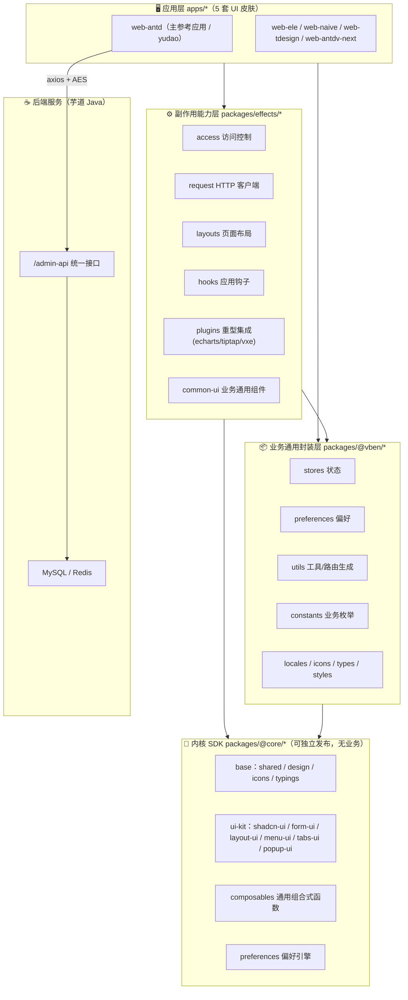
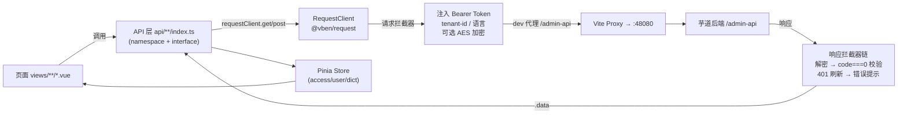
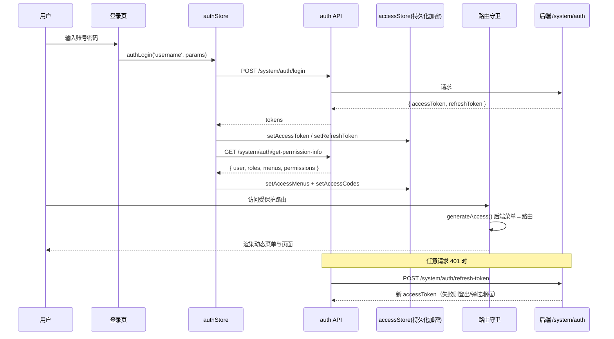
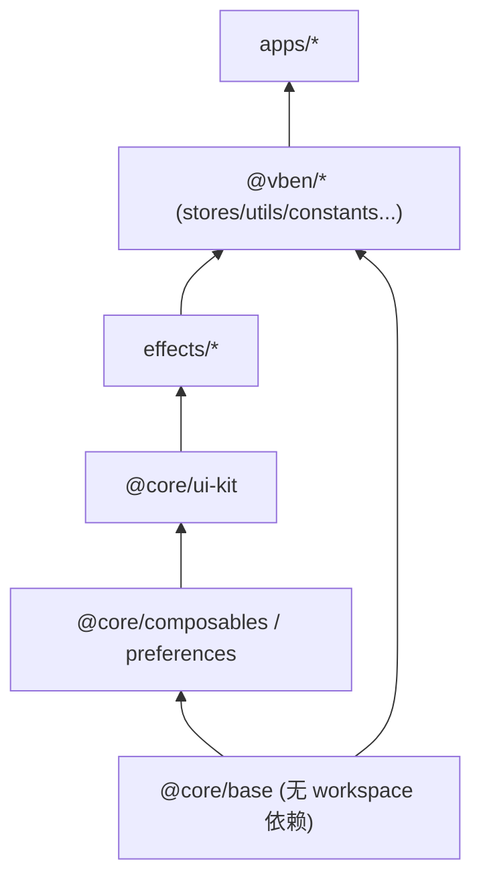
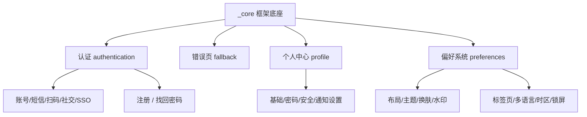
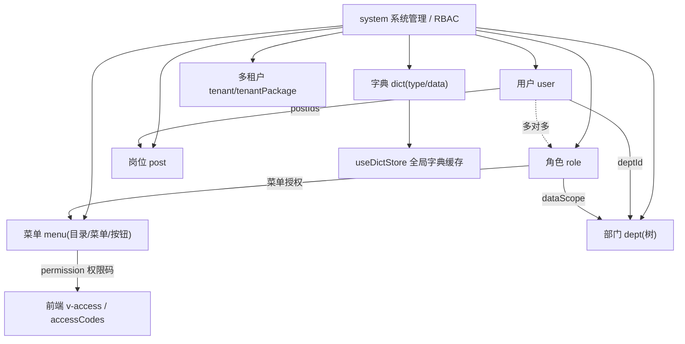
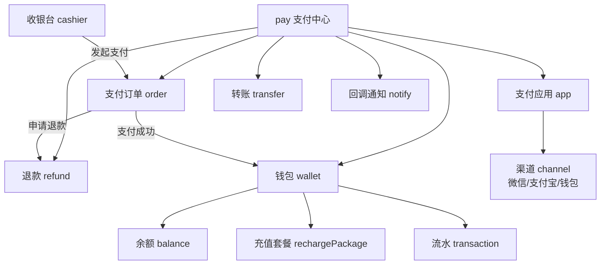
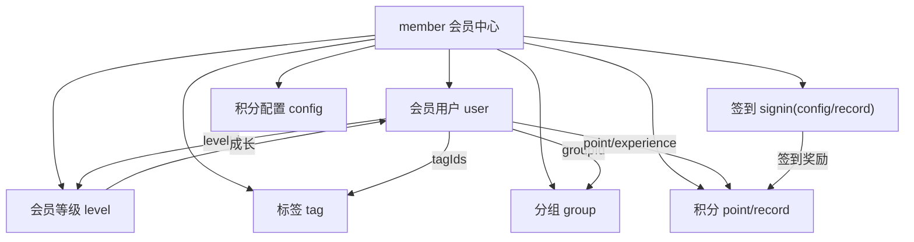
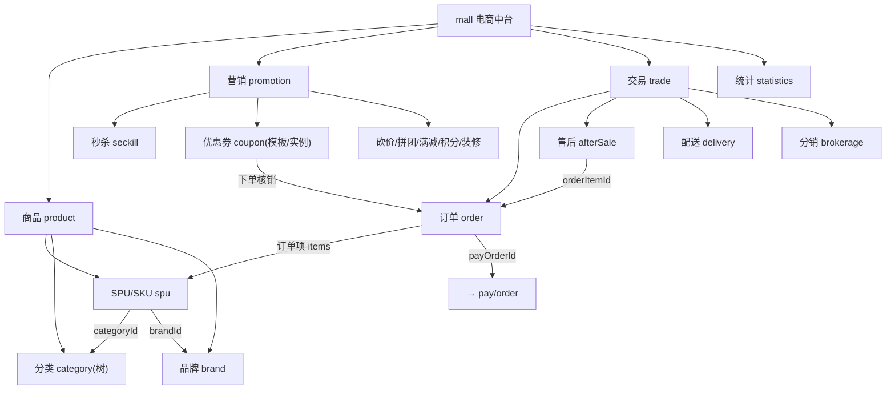
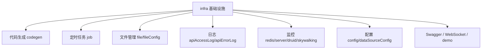

# 中台管理框架 README

> 基于 **Vue Vben Admin v5** 内核构建的 **芋道（yudao）多业务中台前端框架**（Monorepo，命名空间 `yudao-vben-antd`），对接芋道 Java 后端（`/admin-api`）。
>
> 本框架不是一个单一应用，而是一整套「内核 SDK + 副作用能力层 + 业务应用」的分层工程体系，内置支付、会员、商城、RBAC 等 17 大业务域。

---

## 目录

- [一、技术栈（含技术实现的功能说明）](#一技术栈含技术实现的功能说明)
- [二、后端 / 整体架构](#二后端--整体架构)
  - [2.1 分层架构总览图](#21-分层架构总览图)
  - [2.2 前后端数据链路图](#22-前后端数据链路图)
  - [2.3 请求 / 鉴权时序图](#23-请求--鉴权时序图)
  - [2.4 Monorepo 包依赖方向](#24-monorepo-包依赖方向)
- [三、内置功能（按模块细分 + 功能架构图）](#三内置功能按模块细分--功能架构图)
- [四、快速开始](#四快速开始)
- [五、配套文档](#五配套文档)

---

## 一、技术栈（含技术实现的功能说明）

下表列出核心技术，并**明确说明每项技术在本框架中具体实现了什么功能**，而非仅罗列名称。

### 1.1 核心运行时

| 技术 | 版本 | 在框架中实现的功能 |
| --- | --- | --- |
| **Vue 3** | ^3.5.38 | 全框架 UI 运行时，使用 `<script setup>` + Composition API 组织所有页面与组件 |
| **TypeScript** | ^6.0.3 | 全量类型约束；`api/**/index.ts` 中的 `namespace XxxApi { interface Entity }` 即前端对后端数据库实体的类型镜像 |
| **Vite** | 8.0.10 | 开发服务器、HMR、生产构建；通过 `@vben/vite-config` 统一封装，含 `/admin-api` 开发代理 |
| **Vue Router** | ^5.1.0 | 路由与导航；支持「后端菜单动态生成路由」（`accessMode: 'backend'`） |
| **Pinia** | ^3.0.4 | 全局状态管理；配合 `pinia-plugin-persistedstate` + `secure-ls` 实现**加密持久化**（token/权限码落 localStorage） |

### 1.2 UI 与视图能力

| 技术 | 在框架中实现的功能 |
| --- | --- |
| **Ant Design Vue** (^4.2.6) | `web-antd` 应用的组件库；同仓库并存 Element Plus / Naive UI / TDesign / antdv-next 四套皮肤应用 |
| **reka-ui** | `@vben-core/shadcn-ui` 的底层无头组件，框架级基础组件（Dialog / Select / Tabs 等 35+ 原语）由它实现 |
| **VXE Table** (vxe-table ^4.19) | 所有列表页的高性能表格；`useVbenVxeGrid` 封装分页、排序、字典渲染（`CellDict`）、开关列（`CellSwitch`） |
| **Tailwind CSS v4** | 原子化样式与主题变量；配合 `@vben-core/design` 的 design-tokens 实现动态换肤 |
| **ECharts** (^6.1.0) | 仪表盘 / 统计报表图表（`use-echarts.ts`，含地图 map） |
| **TipTap / TinyMCE** | 富文本编辑器（商城商品详情、内容管理） |
| **BPMN.js + camunda-moddle** | BPM 工作流引擎的流程图设计器与流程仿真 |
| **dhtmlx-gantt** | 甘特图（项目 / 任务排期视图） |

### 1.3 表单 / 校验 / 国际化

| 技术 | 在框架中实现的功能 |
| --- | --- |
| **@vben-core/form-ui + vee-validate + zod** | `useVbenForm` 表单引擎：schema 驱动、字段依赖联动、zod 校验（如会员邮箱格式校验） |
| **@form-create** | 低代码动态表单设计器（`form-create` 组件与设计器） |
| **vue-i18n** (^11.4) | 中英双语；`$t()` 全局翻译，`langs/{zh-CN,en-US}` 按命名空间分包懒加载 |

### 1.4 网络 / 安全

| 技术 | 在框架中实现的功能 |
| --- | --- |
| **axios** (^1.18) | `@vben/request` 的 `RequestClient` 底层，封装拦截器、上传、下载、SSE |
| **@microsoft/fetch-event-source** | AI 模块的流式对话（SSE，`postSSE`/`requestSSE`） |
| **crypto-js / jsencrypt** | **接口级 AES 加密**（`X-Api-Encrypt` 请求头）+ **存储加密**（secure-ls）+ 登录密码加密 |
| **qs** | 请求参数序列化（`paramsSerializer: 'repeat'`，适配后端数组参数） |

### 1.5 工程化 / 构建体系

| 技术 | 在框架中实现的功能 |
| --- | --- |
| **pnpm workspace** | Monorepo 包管理（`internal/*`、`packages/*`、`apps/*`） |
| **Turborepo** | 任务编排与增量构建缓存（`turbo build` / `turbo run typecheck`） |
| **oxlint + oxfmt + stylelint + cspell** | 代码检查、格式化、样式规范、拼写检查 |
| **lefthook + commitlint + czg** | Git 钩子、约定式提交校验 |
| **changesets** | 版本管理与 changelog 生成 |
| **nitropack** | *（历史遗留依赖）* Mock 服务插件位存在但本仓库未启用（`VITE_NITRO_MOCK=false`，无 `@vben/backend-mock` 包），实际对接真实后端 |

---

## 二、后端 / 整体架构

> 说明：本仓库是**中台前端框架**，其「后端」指所对接的芋道 Java 服务（`http://127.0.0.1:48080/admin-api`）。下文架构图既覆盖前端分层，也覆盖前端与后端的完整数据链路与鉴权机制。

### 2.1 分层架构总览图

框架采用严格分层：**内核 SDK（无业务）→ 副作用能力层 → 业务应用**。依赖只能自下而上，业务逻辑禁止下沉到 `@core`。



### 2.2 前后端数据链路图



### 2.3 请求 / 鉴权时序图

访问模式为 **backend**：登录后由后端返回菜单树，前端动态生成路由。



### 2.4 Monorepo 包依赖方向



---

## 三、内置功能（按模块细分 + 功能架构图）

`apps/web-antd/src/views` 下共 **17 个业务域**：`_core`、`system`、`infra`、`pay`、`member`、`mall`、`ai`、`bpm`、`crm`、`erp`、`im`、`iot`、`mes`、`wms`、`mp`、`report`、`dashboard`。下文对**核心模块**逐一给出功能描述与功能架构图。

> 统一约定：每个功能模块目录下通常包含 `index.vue`（列表页）、`data.ts`（表格列 / 表单 schema）、`modules/`（表单/详情弹窗）；对应 `api/<模块>/index.ts` 定义数据接口。

### 3.1 基础框架能力（_core）

**功能描述**：登录认证、错误页、个人中心、布局与主题等框架底座能力。

- **多种登录方式**：账号密码、短信验证码、二维码、社交登录（OAuth）、SSO、注册、找回密码
- **错误兜底页**：403 / 404 / 500 / 离线 / 敬请期待
- **个人中心**：基础资料 / 密码 / 安全 / 通知设置
- **布局与偏好**：侧边栏/顶部/混合布局、明暗主题、动态换肤、水印、标签页 keep-alive、全局搜索、锁屏、多语言、时区



### 3.2 系统管理 / RBAC（system）

**功能描述**：企业级权限中枢，基于「用户-角色-菜单/权限码」的 RBAC 模型，并支持**多租户（SaaS）**。

- **用户管理**：账号、昵称、部门、岗位、状态；`SystemUserApi.User`
- **角色管理**：角色码、数据范围（`dataScope` + `dataScopeDeptIds`）
- **菜单管理**：目录/菜单/按钮三级（`Menu.type`），`permission` 权限标识，`parentId` 自引用树
- **部门 / 岗位**：树形部门、岗位
- **字典管理**：`DictType` + `DictData`，前端 `useDictStore` 缓存，`CellDict` 渲染
- **多租户**：租户 + 租户套餐，请求头 `tenant-id` / `visit-tenant-id`
- **其它**：通知公告、邮件、短信、OAuth2、操作日志、登录日志、地区



### 3.3 支付功能（pay）

**功能描述**：统一支付中心，聚合微信/支付宝/钱包等渠道，覆盖下单、退款、转账、通知与钱包。

- **支付应用（app）**：接入方配置，`appKey`、渠道 `channelCodes`、支付/退款/转账回调地址
- **支付订单（order）**：`PayOrderApi.Order`，金额均以**分**存储，状态 `PayOrderStatusEnum`（0 未支付 / 10 已支付 / 20 关闭）
- **退款（refund）**：退款单、退款金额、渠道退款号、错误码
- **转账（transfer）**：向收款人转账
- **收银台（cashier）**：`/pay/cashier` 前端收银台页面（多展示模式：url/iframe/form/qr_code/app）
- **钱包（wallet）**：余额、累计充值/消费、冻结金额、充值套餐、流水
- **支付渠道**：微信（JSAPI/小程序/APP/Native/WAP/条码）、支付宝（PC/WAP/APP/扫码/条码）、钱包、模拟（见 `biz-pay-enum.ts`）



### 3.4 会员中心（member）

**功能描述**：C 端会员体系，涵盖会员资料、等级成长、积分、签到、标签分组。

- **会员用户（user）**：`MemberUserApi.User`，含头像、手机、生日、等级 `levelId`、积分 `point`、经验 `experience`、标签 `tagIds`、分组 `groupId`
- **会员等级（level）**：等级名、所需经验 `experience`、折扣 `discountPercent`、图标
- **积分（point/record）**：积分变动流水，`bizType` 业务类型、`totalPoint` 变动后余额
- **签到（signin）**：签到配置（第 N 天送积分/经验）+ 签到记录
- **标签 / 分组 / 配置**：会员打标、分组、积分抵扣规则



### 3.5 商城 / 电商（mall）

**功能描述**：完整电商中台，覆盖商品、营销、交易、数据统计四大板块。

- **商品（product）**：SPU/SKU（`MallSpuApi`）、分类（树）、品牌、属性、评论；价格以**分**存储（`formatFenToYuanAmount`）
- **营销（promotion）**：秒杀、砍价、拼团、优惠券（模板+发放实例）、满减、积分商城、文章、banner、DIY 店铺装修、客服
- **交易（trade）**：订单（`MallOrderApi.Order`）、售后、配送、分销佣金、交易配置
- **统计（statistics）**：会员/商品/交易/支付统计



### 3.6 基础设施 / 运维（infra）

**功能描述**：开发者与运维工具集。

- 代码生成器 codegen、表单构建 build、配置管理 config、定时任务 job
- 文件管理 file / fileConfig、数据源配置、API 访问日志 / 错误日志
- Redis 监控、服务监控、Druid、SkyWalking、Swagger、WebSocket、演示



### 3.7 其它业务域（概览）

| 模块 | 功能描述 |
| --- | --- |
| **ai** | AI 套件：对话、绘图、知识库（RAG）、思维导图、模型/工具管理、音乐、工作流、写作 |
| **bpm** | 工作流引擎：流程分类、表单、流程模型（BPMN 设计器）、OA、任务、监听器 |
| **crm** | 客户关系：线索、客户、联系人、商机、合同、回款、业绩、统计 |
| **erp** | 进销存：采购、销售、库存、财务、产品 |
| **im / iot / mes / wms** | 即时通讯 / 物联网 / 制造执行 / 仓储管理 |
| **mp** | 微信公众号：账号、菜单、素材、图文、自动回复、用户、标签、统计 |
| **report** | 报表：goview 大屏、jmreport 积木报表 |
| **dashboard** | 仪表盘：analytics 分析页、workspace 工作台 |

---

## 四、快速开始

```bash
# 环境要求：Node ^22.18 || ^24，pnpm >= 11
pnpm install

# 启动主应用（web-antd，默认端口 5666）
pnpm dev:antd

# 其它皮肤
pnpm dev:ele | pnpm dev:naive | pnpm dev:tdesign | pnpm dev:antdv-next

# 构建
pnpm build:antd
```

关键环境变量（`apps/web-antd/.env.development`）：

| 变量 | 值 | 说明 |
| --- | --- | --- |
| `VITE_PORT` | 5666 | 前端开发端口 |
| `VITE_BASE_URL` | http://127.0.0.1:48080 | 后端服务地址 |
| `VITE_GLOB_API_URL` | /admin-api | 接口前缀（dev 由 Vite 代理转发） |
| `VITE_APP_DEFAULT_USERNAME` | admin | 默认登录账号 |
| `VITE_APP_DEFAULT_PASSWORD` | admin123 | 默认登录密码 |

> 提示：本框架默认对接真实的芋道后端，请先启动后端服务（端口 48080）。多租户与接口 AES 加密在 `.env` 中开启（`VITE_APP_TENANT_ENABLE`、`VITE_APP_API_ENCRYPT_ENABLE`）。

---

## 五、配套文档

- 📄 接入自有数据库 / 数据库设计文档：见 [`DATABASE_DESIGN.md`](./DATABASE_DESIGN.md)
